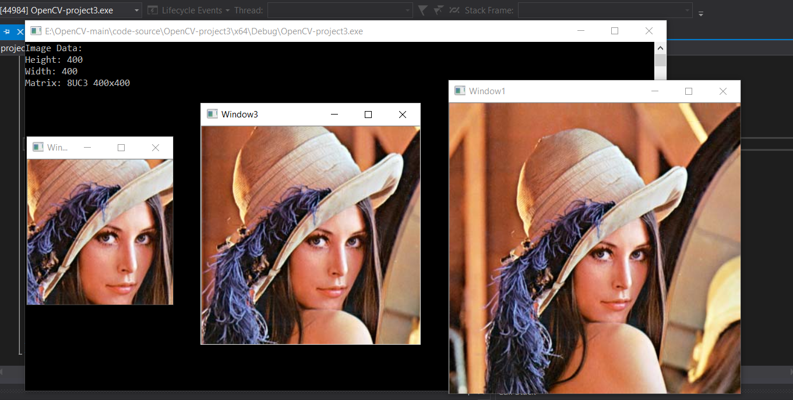
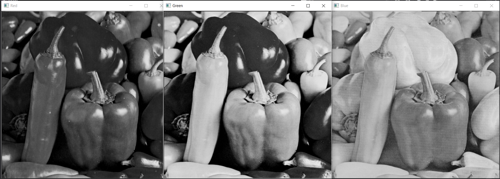
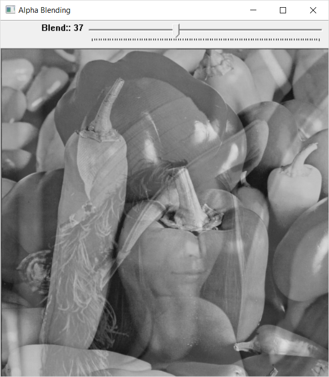
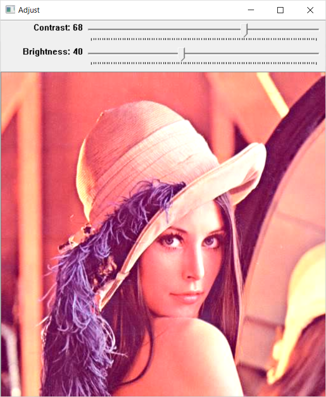
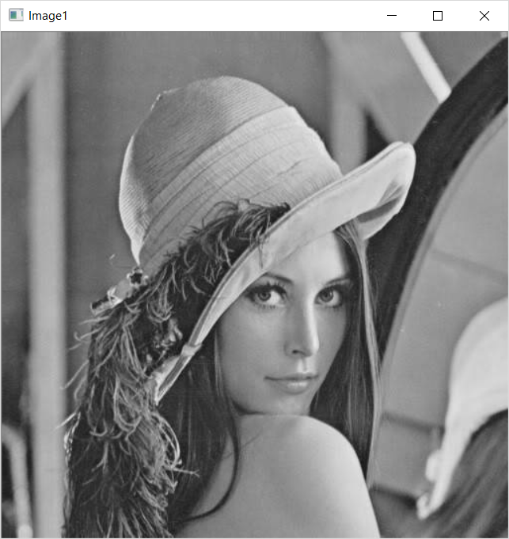
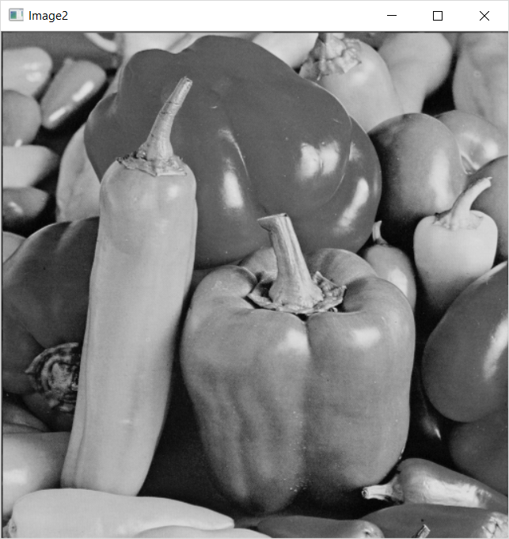
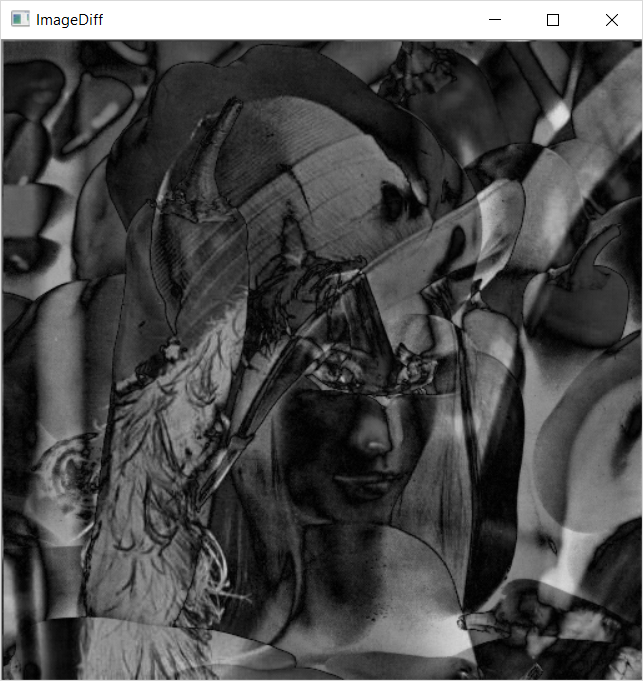
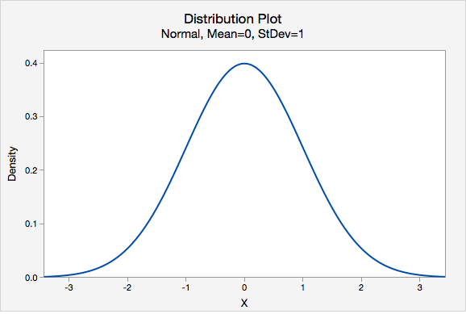
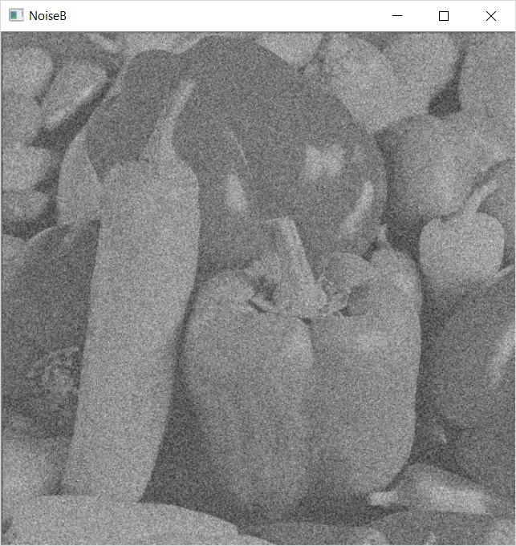
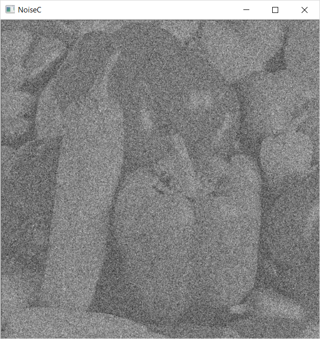

# Week 1:
This week covers the basics of Image Processing and OpenCV Basic Syntax.

* **OpenCV Basics**
  * **Loading Images**
  
  The basic code for loading an image is:
  ```c++
  cv::Mat img = cv::imread(argv[1], -1);
  ```
  Displaying the loaded image is as easy as `cv::imshow("Window1", img);`.
  * **Loading Videos**

  A video file is loaded as a `cap` datatype where every video frame is assigned to a `cv::Mat` for further processing.
  
  ```c++
  cv::VideoCapture cap;
  cap.open(std::string(argv[1]));
  ```
  * **Slicing cv::Mat datatype**
  
  Slicing can be done either by defining a region of interest using `cv::Rect` as:
  
  ```c++
  cv::Rect roi;
  roi.x = 100;
  roi.y = 100;
  roi.width = 200;
  roi.height = 200;

  cv::Mat sliceImg = img(roi);
  ```
  
  It can also be done by using `cv::Range` for defining the row and column range.
  
  ```c++
  cv::Mat sliceImg = img(cv::Range(50,350), cv::Range(50,350));
  ```

  Sample Output:

  

  <hr>

* **Image Processing Basics**
  * **Spliting RGB Colour planes**

  An image can be split into its color planes using `split()` function as:

  ```c++
  cv::Mat colorPlane[3];
  split(img, colorPlane);
  ```

  Then individual planes can be displayed.

  ```c++
  cv::imshow("Red", colorPlane[0]);
  cv::imshow("Green", colorPlane[1]);
  cv::imshow("Blue", colorPlane[2]);
  ```
  Sample Output:

  *Orginal Image*

  

  <hr>

  *Color Planes*

  

  <hr>

  * **Adding two Images**

  This is rather simple
  ```c++
  cv::add(img1, img2, sum);
  ```

  Or you can simple loop through each `cv::Mat` and add corresponding pixel values.
  * **Alphablending two images using Trackbar**

  Alphablending means adding two images but with different weights `alpha` and `beta = 1 - alpha`.

  <a href="https://www.codecogs.com/eqnedit.php?latex=h(x)&space;=&space;\alpha&space;*&space;f(x)&space;&plus;&space;\beta&space;*&space;g(x)" target="_blank"></a>

  OpenCV code implementation is:

  ```c++
  cv::addWeighted(img1, alpha, img2, beta, 0.0, sum);
  ```

  Sample Output:

  

  *Adjust slider to change `alpha`*.
  <hr>

  * **Adjusting Image Contrast and Brightness** (using In-built function)

  OpenCV code implementation:

  ```c++
  img.convertTo(previewImg, -1, contrast, brightness);
  ```
  Sample Output:

  

  <hr>
  
  * **Adjusting Image Contrast and Brightness**

  Manually calculating each pixel:

  ```c++
  for (int x = 0; x < img.rows; x++) {
		for (int y = 0; y < img.cols; y++) {
			for (int c = 0; c < 3; c++) {
				previewImg.at<cv::Vec3b>(x, y)[c] = cv::saturate_cast<uchar>((contrast*img.at<cv::Vec3b>(x, y)[c]) + brightness);
			}
		}
	}
  ```
  * **Displaying Image difference** (using Inbuilt function)

  OpenCV Code Implementation:
  ```c++
  cv::absdiff(imgA, imgB, imgDiff);
  ```
  Sample Output:

  *ImageA*

  

  *ImageB*

  

  <hr>

  *Difference*

  

  <hr>

    * **Displaying Image difference**

    Manually calculating each pixel:

    ```c++
    for (int i = 0; i < a.rows; i++) {
      for (int j = 0; j < a.cols; j++) {
        c.at<uchar>(i, j) = cv::saturate_cast<uchar>(a.at<uchar>(i, j) - b.at<uchar>(i, j)) + cv::saturate_cast<uchar>(b.at<uchar>(i,j) - a.at<uchar>(i,j));
      }
    }
    ```

    * **Adding Gaussian Noise to Images with varying Sigma**
    
    [Gaussian noise](https://en.wikipedia.org/wiki/Gaussian_noise) is statistical noise having a probability density function equal to that of the normal distribution.

    

    We generate it using the `cv::randn()` function:

    ```c++
    cv::randn(noise, 0, sigma); //sigma is the standard deviation and mean = 0
    ```

    Sample Output:

    *For sigma = 0.1*

      

    *For sigma = 0.25*

    

    *For sigma = 0.55*

    
    <hr>

   