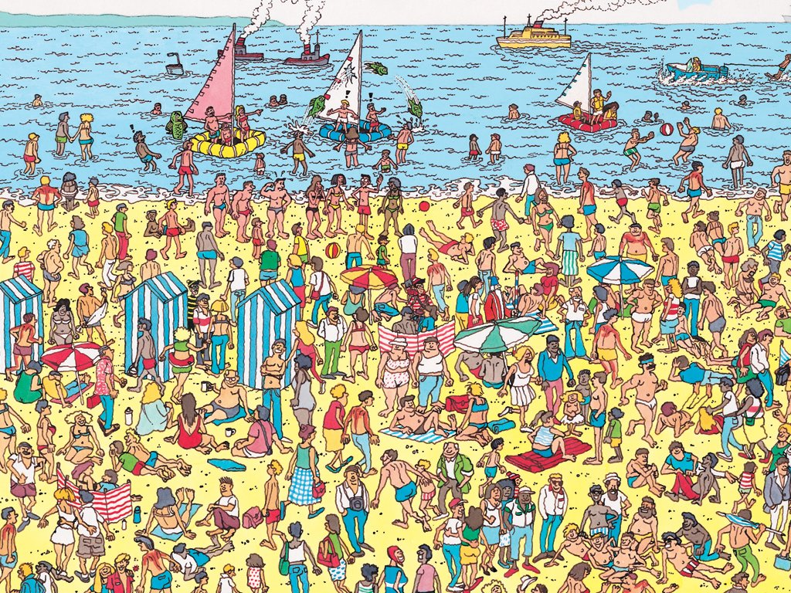
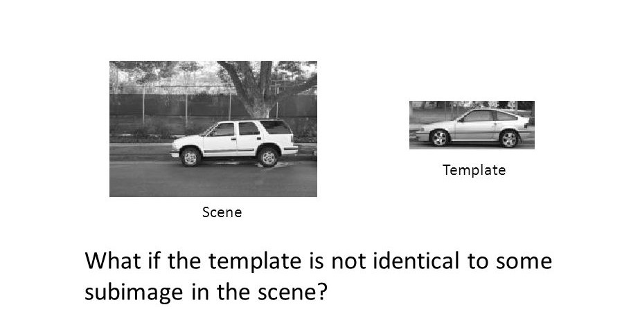

# Filtering as templates

## 1D cross-correlation 
if we take a 1D signal and apply a correlation filter made from a part of the same signal, the resulting waveform will have its highest peak at the region from where the filter was taken.

## 2D cross-correlation
It is same as 1D cross-correlation except now we deal with images and 2D filters.

## Template Matching
If a `template` is created from an `image A`, application of template matching can provide with the location from which the template was created. Even when template matching is performed on an `image B` that is different from `image A` but contains a region having similarity with the `template` then it will provide with the location of that region.

## Possible scenarios for Application

One interesting application is for solving *Where's Waldo?* books where if we are provided with the template of *Waldo* for each picture, we can easily find his location via `template matching`.

**Scene:**

**Template:**

**Is template matching suitable for these applications?**

* Identification of lines in various orientations 

No, lines may varying in thickness, length, orientation, etc and having one template for all such cases is not possible. Even having multiple templates won't go too far. 

* Detecting Faces

No, faces can be of different sizes and may be present in different orientations, also templating different facial expressions is also a problem.

* Identifying icons in a computer desktop

Yes, their sizes are fixed and have a definite orientation as well. They can be easily identified by template matching.

* Identifying cracks in buildings

Cracks and fissures don't have a predictible shape so template matching can't identify them.

## Non-identical Template matching

**Yes, It is possible if scale, orientation and general appearance is similar.**

