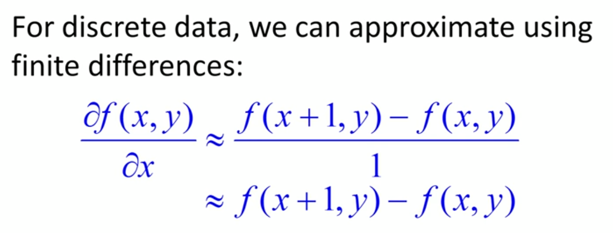

# Edge Detection: Gradients

## Edges

Here is an image of a house:


The given image consist of a small number of black pixels over a background of white. Even after having very less pixel information we can still identify it as a house. The black pixels are forming the edges of the building so it seems that *edges are important*.

## Origin of edges:

* Surface normal discontinuity
* Depth discontinuity
* Surface color discontinuity
* Illumination discontinuity

## Edge Detection

*Basic Idea:* Look for a neighbourhood with strong signs of change

An Edge is place of rapid change in the image intensity function.

Therefore, this rapid change will create a slope from one intensity state to another. We know that the derivative of a function at a point gives us the slope of the function at that point. So applying differentiation at an edge will give us peaks and the extrema of these peaks are the edges.

*Intensity variation at edges:*


**Image Gradient:**

Differential Operators: when applied to an image returns some derivatives. These operators when applied as filters compute the `image gradient function`.


*Direction of Gradient:*


*The gradient points in the direction of most rapid increase of intensity.*


The magnitude of the image gradient is zero when:

* The image is constant over the entire neighbourhood
* The function `f(x,y)` is at a maximum
* The function `f(x,y)` is at a minimum

**Discrete Gradient:**


As continuous derivatives are not possible in programming, therefore we resort to calculating derivatives by `finite differences`.



**Partial Derivative of an Image:**

Apply filter of `[-1 1]` to evaluate PD w.r.t x and apply `[-1; 1]` for PD w.r.t. y.

*Discrete Gradient:*


*Sobel Operator:*


This operation is able in MATLAB as the function `imgradientxy(image,'sobel')`. But you need to multiply it by 1/8 for *normalization*.

*Note:* Using *correlation* or *convolution*, the choice doesn't matter as long we know how to interpret the result. `imfilter` does correlation by default but if we want to perform convolution, we can do so by specifying the option as. Anyway, interpreting results of correlation is much easier.

```matlab
imfilter(A,h,'conv')
```
*Task:* Try the gradient angle finder to find regions with gradient angle of `180 deg or -180 deg`. 

**Applying in Real World:**

Simply applying gradient operation on real world images will not yield satisfactory results because real images don't have smooth distribution of pixel intensity as found in our sample shape images.

Here is an example of intensities along a row or column of an image.


Applying derivative operator, we get:


The noises inherent in the image are the obstacles in detection of the edges. Like all other noises, this noise can be reduced by applying a proper filter.


Therefore, in this example we first apply a gaussian filter to the image and then find the image gradient. The peaks in the image gradient matrix are the edges.   


Also, note that differentiation is associative and linear.


Another way to find the edges using derivatives is to evaluate the second derivative of the image.


The second derivative provides a smooth slope at the edge region.


