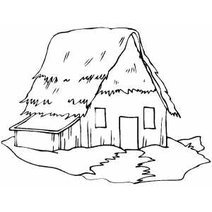

# Edge Detection: Gradients

## Edges

Here is an image of a house:

The given image consist of a small number of black pixels over a background of white. Even after having very less pixel information we can still identify it as a house. The black pixels are forming the edges of the building so it seems that *edges are important*.

## Origin of edges:

* Surface normal discontinuity
* Depth discontinuity
* Surface color discontinuity
* Illumination discontinuity

## Edge Detection

*Basic Idea:* Look for a neighbourhood with strong signs of change

An Edge is place of rapid change in the image intensity function.

Therefore, this rapid change will create a slope from one intensity state to another. We know that the derivative of a function at a point gives us the slope of the function at that point. So applying differentiation at an edge will give us peaks and the extrema of these peaks are the edges.

*Intensity variation at edges:*

**Image Gradient:**

Differential Operators: when applied to an image returns some derivatives. These operators when applied as filters compute the `image gradient function`.

*Direction of Gradient:*

*The gradient points in the direction of most rapid increase of intensity.*

The magnitude of the image gradient is zero when:

* The image is constant over the entire neighbourhood
* The function `f(x,y)` is at a maximum
* The function `f(x,y)` is at a minimum

**Discrete Gradient:**

As continuous derivatives are not possible in programming, therefore we resort to calculating derivatives by `finite differences`.

**Partial Derivative of an Image:**

Apply filter of `[-1 1]` to evaluate PD w.r.t x and apply `[-1; 1]` for PD w.r.t. y.

*Discrete Gradient:*

*Sobel Operator:*

