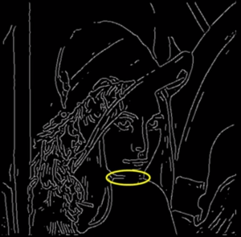
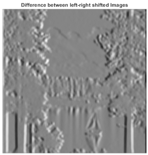
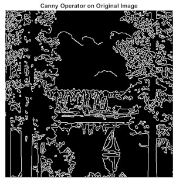
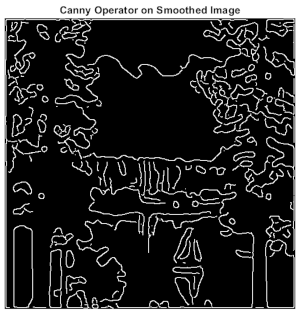
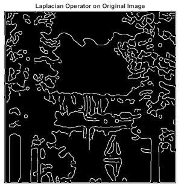

# Edge Detection: 2D Operators

It is preferable to apply the derivative filter `h` to the smoothing filter `g` and then apply the result to the desired image as:

* It poses no problem - both are mathematically equivalent
* As `h` is generally smaller, the number of derivatives required are few
* The smoothed derivative operater once computed, can be used again later.


*Note: Need to clear doubts regarding orientation after correlation and convolution*


As varying values of sigma provides images of varying blurness, in the same way applying gaussian filters of different sigmas will alter the level of edge details visible in an image.

* Small sigma - finer values detected
* Large sigma - large scale values detected


## Edge Detection Steps:

1. Smoothing derivatives to suppress noise and compute gradient.
1. Threshold to find regions of `significant` gradient
1. `Thin` to get localized edge pixels
1. Connect edge pixels

    *Smoothed Image*

     

    *Image Gradient*

     

    *Edge Detection (Inverted colors)*

    

    <hr>
* Canny Edge Operator
    * Filter image with derivative of gaussian
    * Find magnitude and orientation of gradient
    * Non-maximum suppression:

        *Thin multiple pixel wide 'ridges' down to single-pixel width*
      
    * Linking and Thresholding (hysteresis)

        *Define two thresholds: low and high. Use the high threshold to start edge curves and low threshold to continue them*
    
    * MATLAB Code

        ```matlab
        edge(image, 'canny');
        % edge parameter defaults to 'sobel' but it is not that effective
        ```

        
        For documentation:

        ```matlab
        doc edge
        % or else try help edge
        ```
    
* Canny Edge Detector

    **non-maximum suppression :** This method finds pixels that are local maximum along the gradient direction and turns that into forming a continuous curve. It may require checking nearby interpolated pixels.

    *Original Image*

    

    *Magnitude of Gradient*

    

    *Thresholding* 

    

    *Thinning* 

    

    After NMS, we threshold the image pixel values again and sometimes, some pixel information get lost in the 'thinning'.

    

    *More on Canny Threshold Hysteresis*:
    1. Apply a high threshold to detect strong edge pixels
    1. Link the strong edge pixels to form strong edges
    1. Apply a low threshold to find weak but plausible edge pixels
    1. Extend the strong edges to follow weak edge pixels

    *Trick:* To find common pixels between two binary images, try `imshow(img_a & img_b); % binary AND`.

    We know that derivatives accentuate noise but the sensitivity of canny operator to noise depends on the choice of sigma.

* Single 2D Edge Detection Filter

   As discussed in Week-4, we can use the second derivative of a gaussian filter to compute the image gradient, but in this case instead of the maximas(as in case of first derivatives), the edges of the image are detected via zero-crossings in the pixel-intensity graph. 

    

   The second derivative of the gaussian filter is in the form of an 'inverted sombreno'. After computing the first derivative along say x-axis, we now have choices to compute the second derivative in three different ways.

   

   Here, we can define the Laplacian operator which is a second derivative useful for edge detection in monochrome images.

    

* MATLAB Implementation Results

    The various filters and techniques discussed this week were coded in MATLAB and the following results were obtained:

    *Test Image*

    

    *3D Plot of the Gaussian Filter used*

    

    *Basic Image Gradient Filter*

    

    *Canny Operator on Original Image*

    

    *Canny Operator on Smoothed Image (sigma = 4)*

    

    *Laplacian Operator on Original Image*

    

    <hr>

    **The relevent code can be found in the `./MATLAB` Folder**

