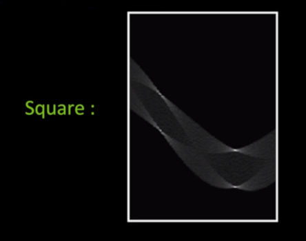
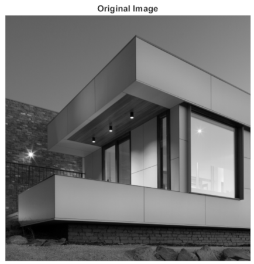
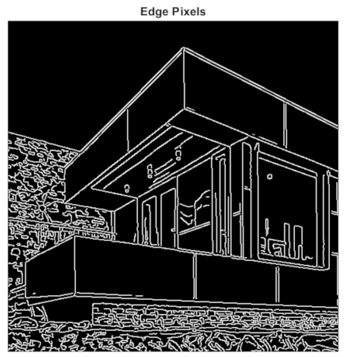
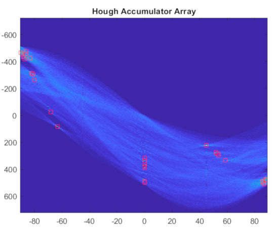
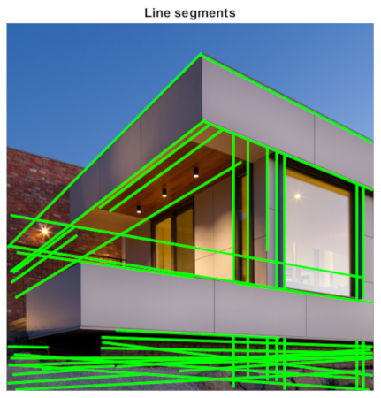
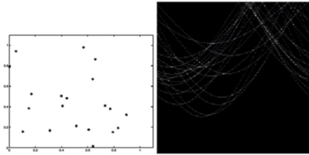

# Hough Transform

Till now, we have only studied concepts related to traditional image processing, where we take an image function `I(x,y)` and after computation get the output of another output function `I'(x,y)`. **Hough transform** is one of the first computer vision technique that provides **intelligent** information from a given input of an image function `I(x,y)`.

Finding lines in a given image:


Finding circles in a given image:


Or any arbitrary shape:


## Related Terms

* Parametric Model: it can represent a class of instances where each is defined by a value of the parameters. For instance, lines, circles or even a parameterized template.

* Fitting a parametric model
    * Choose a parametric model to represent a set of features
    * Membership criterion is not local:
        it is not possible to tell if a point in the image belongs to a given model just by looking at that point

    * Computational complexity is vital

## Line Fitting

* Line fitting from Edge detection : Problems
    * Extra edge points(clutter), multiple models
    * only parts of line are detected (missing parts)
    * Noise in measured edge points

    

## Voting

Voting is a general technique where we let the features vote for all models that are compatible with it.

Algorithm:

1. Cycle through features, each casting votes for model parameters.
1. Look for model parameters that receive a lot of votes.

Why is works:

* Noise and clutter features cas votes too, but typically their votes should be inconsistent with the majority of **'good'** features.

* It is okay if some features are not observed, as model can span multiple fragments.

## Hough Transform

* Given points that belong to a line, what is the line?
* How many lines are there?
* Which points belong to which lines?

It is a `voting` technique that can be used to answer all of these.

Principle:

1. Each edge point votes for compatible lines.
1. Look for lines that get many votes. 

## Hough Space

It is possible to represent points and lines in 2D plane. Points are characterized by the two parameters of *abscissa* `x` and *ordinate* `y`. While lines are characterized by their respective *gradients* `m` and *intercept* `b` as in `y = m*x + b`. In Cartesian co-ordinate system, we assign `x` and `y` along the two axes and according to this system, we can easily plot points and lines in a plane.

In Hough Space, gradient `m` and intercept `b` are actually assigned along the two axes because of which a line (formed by using `m` and `b`) can simply be represented by a point. While a point is now defined as `b = -m*x + y` and is represented as a line in hough space. 

* A line in an image corresponds to a point in Hough (parameter) space.


* A point in image space is a line in Hough space.


Suppose that we plot two points `A(x1, y1)` and `B(x2, y2)` in image space, then these are represented by lines `b = -m*x1 + y1` and `b = -m*x2 + y2` in hough space. Now the intersecting point of these two lines when represented in image space gives us the line passing through points `A` and `B`.


For the purpose of `line fitting`, we divide the hough space into a grid of bins and then plot lines according to the points in image space. Everytime a line passes through a bin, it adds to the `vote count` for that bin. After plotting all the lines, the bin that has accumulated the maximum number of votes represent the required line in image space.


Note: While expressing lines in terms of gradient `m`, representing vertical lines with gradient `infinity` is not feasible, so we use polar representation of lines.

## Polar representation for lines


As shown in figure, every line can be characterized by the distance from origin `d` and the angle `theta`. We also realize the property that `xsin(theta) + ycos(theta) = d`. Interestingly,a point (x,y) is now represented in hough space in the form of a **sinusoid**. 

* Point in image space is now sinusoid segment in Hough space.

Now, there arises ambiguity for the orientation of a line. Assuming `d` to be positive, we require to define `theta` for the range `(0, 360)`, but if we allow `d` to be signed then the theta range is reduced to `(0, 180)`.

## Hough transform algorithm

We are going to use the polar representation of  `xsin(theta) + ycos(theta) = d` and a Hough Accumulator array  ( grid with `theta` along x-axis and `d` along y-axis ) to keep track of the votes. 

* Basic Hough transform algorithm


1. Initialize HAA to 0.
1. For each **edge** point in `E(x,y)` in the image.
    ```
        for theta = 0 to 180
            d = xsin(theta) - ycos(theta)
            H[d, theta] += 1
    ```
1. Find the value(s) of `(d, theta)` where `H[d, theta]` is maximum.
1. The detected line in the image is given by:

    ```
    xsin(theta) + ycos(theta) = d
    ```

Note: negative `d` is possible because the `d` of the bins is defined in negative range too. as in `(-500, 500)`.

* Complexity of the Hough transform
    * Space complexity

    The HAA requires `k to the power n` bins where n is the dimension (2 for images) and k is the number of bins each.

    * Time complexity

    Time complexity is constant in the number of features or edge points we have detected.

* Hough Transform Examples

    Here is an example of a hough transform apply to an image having some points lined up straight.

    

    On applying hough transform on a square:

    

    The bright points in the image represent the lines, the brightness of the point represent the votes accumulated by the bin.

    

    * If several points lie (densely) in a small region of hough space. It represents lines in image that are present in similar orientation and distance from the origin.

    * Demonstration on Real-life images

    We took an image of a building and then applied hough transform with parameters of:
    ```
    Threshold: 0.44*MAX
    NHoodSize: [11 11]
    FillGap: 40
    ```
    Using a different set of parameters may provide better results.

    Original Image:

    

    We use canny operator on the original image to find the edge pixels

    

    Hough Accumulator Array here houses the sinusoids corresponding to points in the image. The bright spots in hough array are the maxima, the highlighted maxima are ploted as lines in the next figure. 
    
    

    Line Segments plotted:

    

* Impact of noise on Hough transform

   If noise is applied to a image with points lying along a straight line, then the maxima obtained in hough space for the points will be distorted and might even be missed as a maxima if the bin sizes are very small.

   

   In order to find the general peak of the noisy image, one can smooth the image by applying appropriate filter and then apply hough transfrom with finer bins.

   It may also be possible that the noise present in the image contain points that accidentally lie along a line and then appear as a maxima in hough space. So, it is required to assess that the found peaks are real or simply generated by the noise. Knowing the total number of lines beforehand helps in this case.

   

* Extensions of Hough transform

    **Extension 1:**

    An extension used in the general Hough transform algorithm is that instead of iterating over a range of theta, we can iterate over a smaller range around the gradient at that point. This saves us time spent in voting.

    **Revised Algorithm Snippet**
    
    ```
    for theta = gradient(x,y) //Extension
        d = xsin(theta) - ycos(theta)
        H[d, theta] += 1
    ```

    **Extension 2:**

    Count more votes for stronger edges

    **Extension 3:**

    Change the sampling of `(d, theta)` to get more/less resolution

    **Extension 3:**

    This procedure can be applied to find circles, squares or any other shape (including shapes defined by templates).

    


