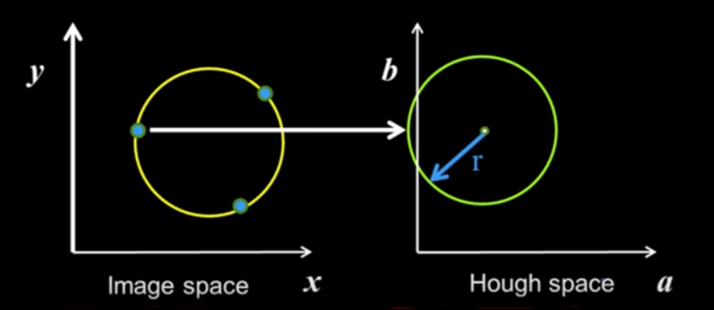

## Hough Transform - Circles

Lines (discussed last week) are the easiest version of parametric models. The equation of a circle is given by ( x - a )<sup>2</sup> + ( y - b )<sup>2</sup> = r<sup>2</sup> that represents a circle with centre at `(a,b)` and radius `r`. 

Let us assume that we are to find the centre of a circle in image space by using the circle's radius and the co-ordinates of known three points.


 We construct the hough space by plotting abscissa and ordinate of centre of the circle along x and y axis respectively. A known point (x,y) in image space represents circle with radius `r` and centre `(x,y)` in hough space. All three points lying on the circle in image space are plotted as circles in hough space and the voting technique is used. The co-ordinates of the bin which gets maximum votes are the required centre co-ordinates. 

 

### Example of Hough transform


In the above shown image, the crosshair formed depicts the location of the centre of the circle along with its size. The rectangle formed estimates the motion of the circle, the rectangle extends below the shape of the circle as it has considered the motion of the bowling bowl's reflection as well (due to the shiny surface beneath it).

### Detecting circles with Hough (r known)

We take an image containing both pennies and quarters. Having different radius, we will have to perform two hough transforms for each type. First, we apply canny operator on the original image to detect the edges. In order to find the penny in the image, we take `r` equal to the radius of the penny and then obtain the hough space. The centre of the penny is detected in the form of a bright spot. Some less bright regions are detected around the location of the quarters, as several overlapping circles having radius `r` can fit inside it. These regions of bins receive votes and create such less bright areas.


Similarly, the quarters can be detected by applying the hough transform with radius equal to that of the quarter.


### Detecting circles with Hough (r unknown)

In the examples considered before, the radius of the required circle was known. But if we are to find a circle in image space using only known points, then we have to create a three-dimensional hough space with radius `r` along the z-axis.


If we consider all values of `r` then we realize that each point in the circle now represent a cone in hough space.


As discussed before, one can plot three points in the hough space and then find the centre of the circle using voting technique. But doing so in three-dimension is *very complicated*. Later algorithms like RANSAC overcome this dimensionality.


### When the gradient at a point is known

If we known the gradient of the circle at a given point, the difficulty(as compared to previous case) in finding the required circle is quite reduced. We know that the centre of the circle always lies along the perpendicular drawn from any tangent line so as the gradient is known we only need to vote for bins that lie along a single line in three-dimensional hough space.


### Algorithm for Circles

The psuedocode for the hough transform for **circles** is given below:

```
for every edge pixel (x,y):
    for every possible radius value 'r':
        for each possible gradient direction 'theta':
            % or use estimated gradient
                a = x - r*cos(theta)
                b = y + r*sin(theta)
                H(a,b,r) += 1
        end
    end
end
```

Adding the third dimension to the voting technique increases the workload exponentially. Assume you had `100 bins` for one dimension, in two-dimension the number of bins will be `10,000` and finally, for three-dimensions the number of bins will be 1 million (10<sup>6</sup>) !

### Tips for voting technique

1. Minimize the number of irrelevant tokens - take edge points with significant gradient magnitude.

2. Discretization
    * If too coarce, large votes are obtained when too many different lines correspond to a single bucket.

    * If too fine, miss lines because some points that are not exactly collinear cast votes for different buckets.

3. Vote for neighbouring bins as well (for smoothing the HAA)

4. Utilize direction of edge to reduce free parameters

5. To retrieve back which points that voted for winning peaks, keep track of the points that voted for a bin.

### Pros and Cons

Pros:
* All points are processed independently, so can cope with occlusion
* Resistant to noise to an extent, noise points unlikely to contribute consistently to any single bin.
* can detect multiple instances of a model in a single pass.

Cons:
* complexity of search time increases exponentially with the number of model parameters
* Non-target shapes can produce spurious peaks in parameter space (for instance, ellipses when finding circles)
* it is difficult to select a good grid size


