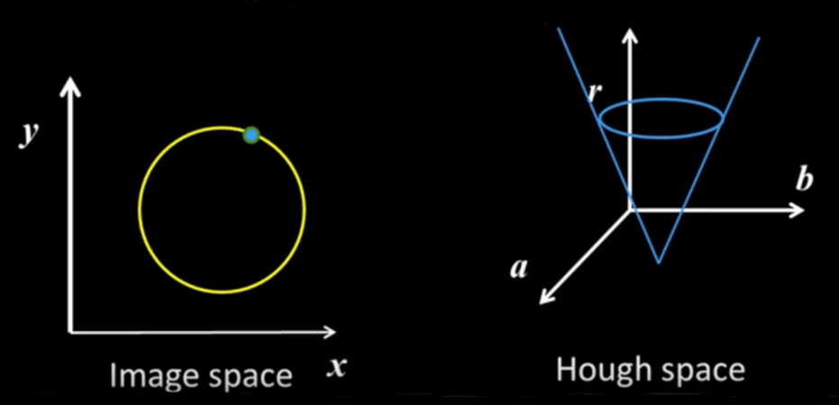

## Hough Transform - Circles

Lines (discussed last week) are the easiest version of parametric models. The equation of a circle is given by ( x - a )2 + ( y - b )2 = r2 that represents a circle with centre at `(a,b)` and radius `r`. 

Let us assume that we are to find the centre of a circle in image space by using the circle's radius and the co-ordinates of known three points.

 We construct the hough space by plotting abscissa and ordinate of centre of the circle along x and y axis respectively. A known point (x,y) in image space represents circle with radius `r` and centre `(x,y)` in hough space. All three points lying on the circle in image space are plotted as circles in hough space and the voting technique is used. The co-ordinates of the bin which gets maximum votes are the required centre co-ordinates. 

 

### Example of Hough transform

In the above shown image, the crosshair formed depicts the location of the centre of the circle along with its size. The rectangle formed estimates the motion of the circle, the rectangle extends below the shape of the circle as it has considered the motion of the bowling bowl's reflection as well (due to the shiny surface beneath it).

### Detecting circles with Hough (r known)

We take an image containing both pennies and quarters. Having different radius, we will have to perform two hough transforms for each type. First, we apply canny operator on the original image to detect the edges. In order to find the penny in the image, we take `r` equal to the radius of the penny and then obtain the hough space. The centre of the penny is detected in the form of a bright spot. Some less bright regions are detected around the location of the quarters, as several overlapping circles having radius `r` can fit inside it. These regions of bins receive votes and create such less bright areas.

Similarly, the quarters can be detected by applying the hough transform with radius equal to that of the quarter.

### Detecting circles with Hough (r unknown)

In the examples considered before, the radius of the required circle was known. But if we are to find a circle in image space using only known points, then we have to create a three-dimensional hough space with radius `r` along the z-axis.

If we consider all values of `r` then we realize that each point in the circle now represent a cone in hough space.

As discussed before, one can plot three points in the hough space and then find the centre of the circle using voting technique. But doing so in three-dimension is *very complicated*.

