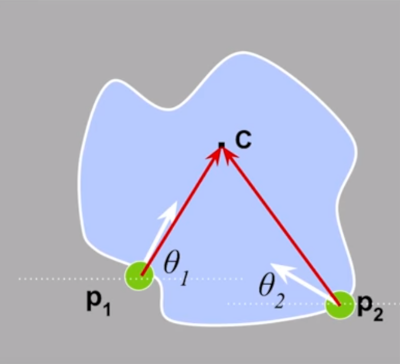

## Introduction

In week 6 and week 7, we learnt about the non-analytic models where we used hough transfrom to detect fixed shapes. Now, we shall work with visual code-word based features where we don't rely on edges but utilize detected templates learnt from models.

### Generalized Hough Transform

Earlier, we were able to detect lines and circles using hough transfrom by converting pixels in image to lines in hough space and then voting to find the bins with the maximum votes. But for finding arbitrary shapes we contruct a `hough table` and follow the given steps:

**Training:** Building a hough table

1. Take a boundary point **pi** and calculate its displacement vector **r** w.r.t to a reference point **c** as r = c - pi.

2. Measure the gradient angle `theta` at the boundary point.

3. Store the displacement value in the table and index it by `theta`.

**Recognition:**

1. At each boundary point, compute the gradient angle `theta`.

2. Look up the index `theta` and find all the displacement based on it.

3. For each displacement value, vote for the centre.

