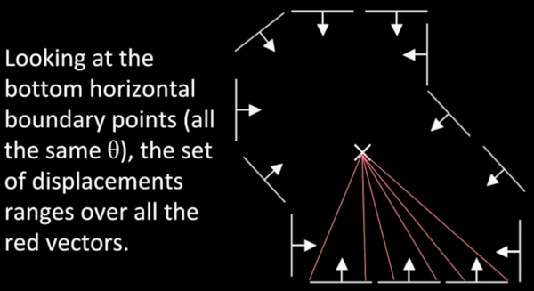
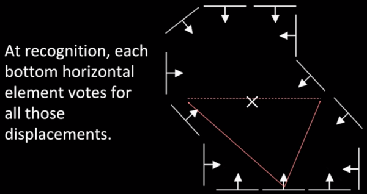

## Introduction

In week 6 and week 7, we learnt about the non-analytic models where we used hough transfrom to detect fixed shapes. Now, we shall work with visual code-word based features where we don't rely on edges but utilize detected templates learnt from models.

### Generalized Hough Transform

Earlier, we were able to detect lines and circles using hough transfrom by converting pixels in image to lines in hough space and then voting to find the bins with the maximum votes. But for finding arbitrary shapes we contruct a `hough table` and follow the given steps:

**Training:** Building a hough table

1. Take a boundary point **p<sub>i</sub>** and calculate its displacement vector **r** w.r.t to a reference point **c** as r = c - p<sub>i</sub>.

2. Measure the gradient angle `theta` at the boundary point.

3. Store the displacement value in the table and index it by `theta`.


**Recognition:**

1. At each boundary point, compute the gradient angle `theta`.

2. Look up the index `theta` and find all the displacement based on it.

3. For each displacement value, vote for the centre.

Let us now look at a more descriptive example, first we assess the lower boundary where the gradient direction is vertical. Using this boundary, we compute the gradient `theta` and the displacement `r`. 



At recognition, a boundary point p<sub>1</sub> with gradient `theta` will vote for points located at all the displacements `r` indexed in the list by gradient `theta`. 



Similarly, every such boundary point p<sub>i</sub> will vote for all the indexed displacements w.r.t. to its own position.


Eventually, at the end of voting by those boundary points, we will be left with a line which represents the possible positions of the centre of the shape. More intensity indicates higher number of votes.


Now, following the same procedure for the boundary points with a different gradient, we are able to plot another line for possible positions of the centre.


The intersection point of the two lines is the position of the centre.


## Generalized Hough Transfrom

We now look into the algorithm for generalized hough transform for any arbitrary shape

```
if the orientation is known:
    1. for each edge point
            compute gradient direction theta
            retrieve displacement vectors r to vote for reference point
    2. peak in the hough space(x,y) is the reference point with most        supporting edges
```

```
if the orientation is unknown:
    1. for each edge point
            for each possible master theta_star
                compute gradient direction theta
                theta_prime = theta - theta_star

                for theta_prime, retrieve displacement vectors to vote for reference point.
    peak in this hough space (x,y,theta_star) is now the reference point
```

**Note**: The space complexity of such three-variable space is cubic ( k<sup>3</sup>).

A similar algorithm can be applied for finding shapes of arbitrary scale `S`.

```
if the scale S is unknown:
    1. for each edge point
            for each possible master scale S:
                compute gradient direction theta
                for theta, retrieve displacement vectors r
                    vote r scaled by S for reference point
    peak in this hough space (x,y,S) is now the reference point
```

**Note**: The space complexity of such three-variable space is cubic and if we want to determine the orientation as well as scale, the space complexity will be quartic ( k<sup>4</sup> ).

## Application in Recognition

Now we are going to look how hough transform is used in modern algorithms to recognize objects. Unlike how we indexed displacements based on gradient direction `theta`, in this approach the displacements are indexed by *visual codewords*


As shown in the image above, we use the patches of car tyres like the boundary points to record the displacements and then the two displacements are indexed under the same *visual codeword* as depicted in the image in the right side.

### Training: *Visual codewords*

1. Build codebook of patches around extracted interest points using *clustering* 


The clustered patches are the features that we are going to look for in the images.

2. Map the patch around each interest point to closest codebook entry.


3. For each codebook entry, store all displacement relative to object center.


### Testing 

Let us now go through the steps involved in recognizing objects using *visual codewords*. We take the following image for recognizing a car by using the visual codewords of car tyres.


The algorithm is able to recognize the car tyres using the visual codewords.


Based the displacements retrieved in the training phase, we plot the possible displacements in this image and then based on the number of votes ascertain the position of reference point in the image.


